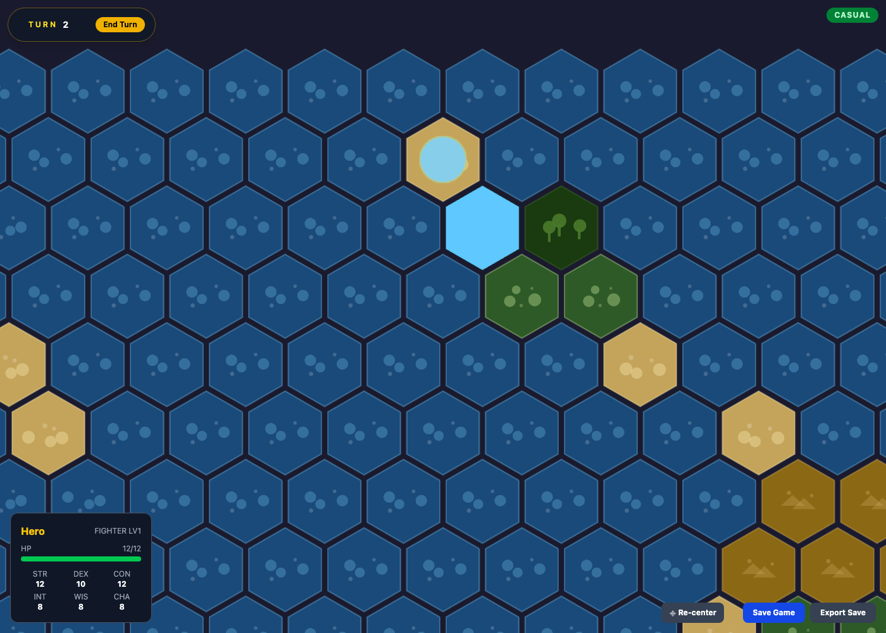

# Hex Crawl Game

This is a simple rogue-like turn-based hex crawl game built using Phaser 3 and Typescript.  The game features a party of adventurers exploring a world map, engaging in combat, and managing resources.  The codebase is organized into modules for different game systems, with a focus on maintainability and extensibility.

## Inspiration

[Spec Driven Development (SSD)]() has become a popular paradigm for building software recently and I have personally been asked (and kinda told) that it was the direction that software engineering was going.  As such I wanted to explore the idea of building something using the pattern.

In my search for a _template_ for what a SSD file might look like, I came across [GitHub's Spec Kit](https://github.com/github/spec-kit) which is a set of GitHub Copilot agent definitions for driving an SSD workflow. I decided to use this as the basis for my implementation, and to document my learnings and process along the way.

As a gamer, there is always a dream to build your own game (or maybe it's just me 😅). Drawing on some inspiration from Dungeons and Dragons and Fire Emblem I took this idea for a turn based hex crawler.

For those looking to give GitHub Spec Kit a try, I created a [Cheat Sheet](./docs/SpecKitCheatSheet.md) that walks through the steps of the workflow and provides tips for using it effectively.  This was available in the CLI when I originally created the repo but is not included in their documentation, so I thought it would be helpful to have a reference guide for myself and others.